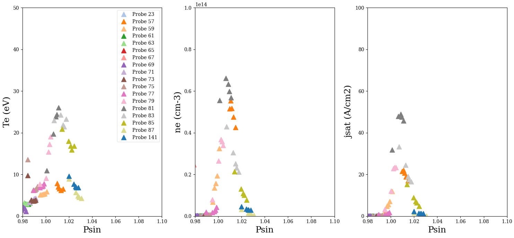
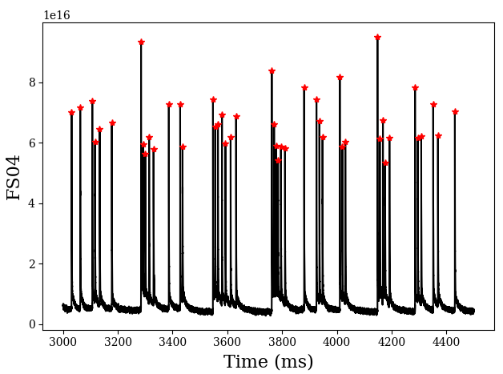

# tools
This is a collection of tools mostly related to DIII-D data access.

## gadata.py
This is a DIII-D script found on the internal website, i.e. Shawn did not write this. Example usage:
```
$ python3
>>> from gadata import gadata
>>> import MDSplus as mds
>>> conn = mds.Connection('localhost')   # Needed if linking iris to localhost. See utk-fusion README for details.
>>> conn = mds.Connection('atlas.gat.com')  # If working on NoMachine or on the DIII-D network (needs testing).
>>> ga = gadata("DENSV2", 167196, connection=conn) 
>>> time = ga.xdata
>>> dens = ga.zdata
```

## get_lp.py
This allows one to pull target Langmuir probe data into a Python session and optionally save it as a .csv file. Example usage:
```
$ python3
>>> import get_lp

# Get LPs plotted against R-Rsep, bin each LP data into 5 bins equally spaced in indicated 
# time range and report the median values in each bin.
>>> lps = get_lp.plot_lps(167195, 2000, 5000, xtype="rminrsep", bins=5, filter="median")
>>> lps.keys()

# Plot against psin, report average values of each bin.
>>> lps = get_lp.plot_lps(167195, 2000, 5000, xtype="psin", bins=5, filter="average", csv_path="/path/to/save/lp_167196.csv")

```
<p align="center">
  
</p>

Note the inner and outer target LPs are plotted on the same graph here. 

## elm_frequency.py
A relatively simple script to estimate the ELM frequency. There are more rigourous ways to do this, but this is a simple starting point I suppose. Example usage:

```
$ python3
>>> import elm_frequency as elm
>>> time, fs = elm.get_fs_data(167247, "FS04")  # Load filterscope data.

# Pass in the filterscope data and see if we correctly identify the peaks. distance and height are
# the same as distance, height in the scipy function find_peaks, so best read the documentation for more info.
>>> elm.calc_freq(time, fs, "FS04", time_window=[3000, 4500], distance=200, height=2e16)
```
It will probably require some trial and error playing with distance and height. The red stars indicate a detected ELM. You want to make sure you aren't double counting ELMs, or counting tiny spikes in the data as ELMs (unless you think they might be!).

<p align="center">
  
</p>

## ThomsonClass.py
To do. Unsure if I want to document this since generally it may be better to use OMFIT when it comes to getting clean filtered data, but if you want just the "raw" ne, Te data this will work. Also the elementary 2D plot capability, but still maybe best to hunt down Adam Mclean's IDL scripts on iris for that.

## generate_3d_wall_for_mafot.py
The MAFOT code is installed on the iris cluster and is the tool of choice for getting connection lengths for our collector probes, among other options. By default it uses the 2D wall provided by the gfile, which effectively assumes every limiting surface is toroidally symmetric. We know this is not true (bumper limiters, antennas, ports, etc.), so fortunately MAFOT has the option to provide a 3D wall file, which is a file of the 2D cross-section at every toroidal degree. This script generates that file by slicing a provided 3D CAD STL mesh file at each degree and formatting it for input to MAFOT (via it's "-W" flag) by writing the coordinates for each slice in the clockwise direction. The script is run from the command line (not the python interpretor) as follows:
```
# Create a file mafot_3D_wall.dat in working directory.
shawn@karen: python3 generate_3d_wall_for_mafot.py "/path/to/file.stl"
# Create the file as well as a gif of the wall at each angle. This is useful when
# you want to make sure the points came out correctly sorted (i.e. clockwise). 
# Check to make sure the lines between corddinates don't make any unecessary jumps
# that disconnects a continuous wall.
shawn@karen: python3 generate_3d_wall_for_mafot.py "/path/to/file.stl" true
```
This script has only been tested to work correctly with the STL file 20210826_vessel_mesh.stl. Future meshes could require code development. To run MAFOT with the generated input file, the steps are:

1. On iris, **module load mafot** and then **mafot_gui.py**.
2. Fill out the top section of the GUI, and then at the bottom select the dtlaminar tab.
3. Fill out this tab accordingly with the coordinates and such. Hint: For MiMES tor. Angle = -240. 
4. Click run. On the terminal it will tell you to run a command. Don't do that yet! In your directory open up the MAFOT shell script mafot.sbatch.
5. After \_lam.dat include **-W mafot_3D_wall.dat** (assuming you've already moved this file to the working directory on iris). 
6. Then run the command given by the GUI. You can check progress via **squeue -u $USER** and looking at the **batch_mafot.out** file.
7. The file lam_[file\_tag].dat will contain the connection lengths.
